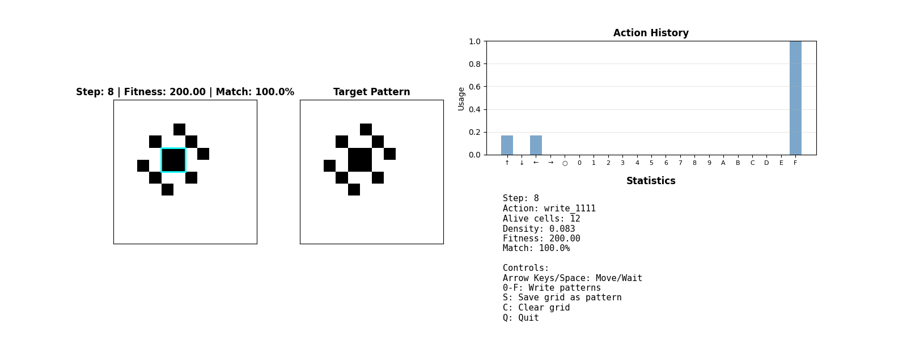

This repository contains the Python version of a Reinforcement Learning (RL) project that is under development. 

I originally started out exploring an Actor-Critic RL framework, but I have now pivoted to exploring evolutionary algorithms.

The goal of the overall project is to have some RL agent(s) (or evolutionary algorithm process) "learn" to play a game in a cellular automata (CA) environment. 

In the end, this project is meant to engage users, be visual, and be part of a broader distributed machine learning project and website. [That website](https://www.nets-vs-automata.net) uses client-side computation with TensorFlow.js. JavaScript will be used in the final implementation of this project, but in the current phase, the exploratory phase, Python is being used.

Here's the web page currently under development. The last update reflects a point in time when Actor-Critic RL framework was being used:
https://www.nets-vs-automata.net/rl.html

# Pattern Game 🪄

Goal:   
Starting from a blank Game Of Life cellular automata grid, take actions to generate the target pattern. Between each action (move left, right, up, down, do nothing, or write one of 16 2x2 pattern), the Game Of Life will update one step.  

For instance:  
The pattern in the picture below can be generated from the following actions: F (i.e. write a [[1, 1], [1, 1]] pattern), [Game of Life update step], Right, [GoL update], Up, [GoL update],  F, [GoL update], F, [GoL update], F, [GoL update], F, [GoL update], F, [GoL update]. You can also see another sequence of actions in the picture below that also leads to the same pattern after 10 steps, which would be a perfect result in the 10-step game.


Game Dev Notes:  
These games can be generated and filtered to interesting pictures (i.e. not blank) but right now the process is for the user to manually generate one.




# Command Line

### Create a target pattern through drawing it 
```
uv run evo_ca.py create_pattern --grid-size 12
```

### Controls:
- **Arrow Keys**: Move agent up/down/left/right
- **Space**: Do nothing action
- **0-F keys**: Write 2x2 patterns (hex notation)
- **S**: Save current grid state as a pattern file
- **C**: Clear the grid
- **Q**: Quit

### Play in Manual Mode (and save a target pattern)
```
uv run evo_ca.py manual --grid-size 12 --pattern-file custom_pattern_12x12_sample.npy
```

### Train with evolutionary algorithm
```
uv run evo_ca.py train \
  --pattern-file custom_pattern_12x12.npy \
  --generations 500 \
  --population-size 100 \
  --sequence-length 10 \
  --mutation-rate 0.1 \
  --live-plot
```

### Demo the best sequence found
```
uv run evo_ca.py demo --sequence-file best_sequence.npy --pattern-file custom_pattern_12x12.npy
```

### Live plot every 50 generations
```
uv run evo_ca.py train --pattern-file custom_pattern_12x12.npy --live-plot 50
```