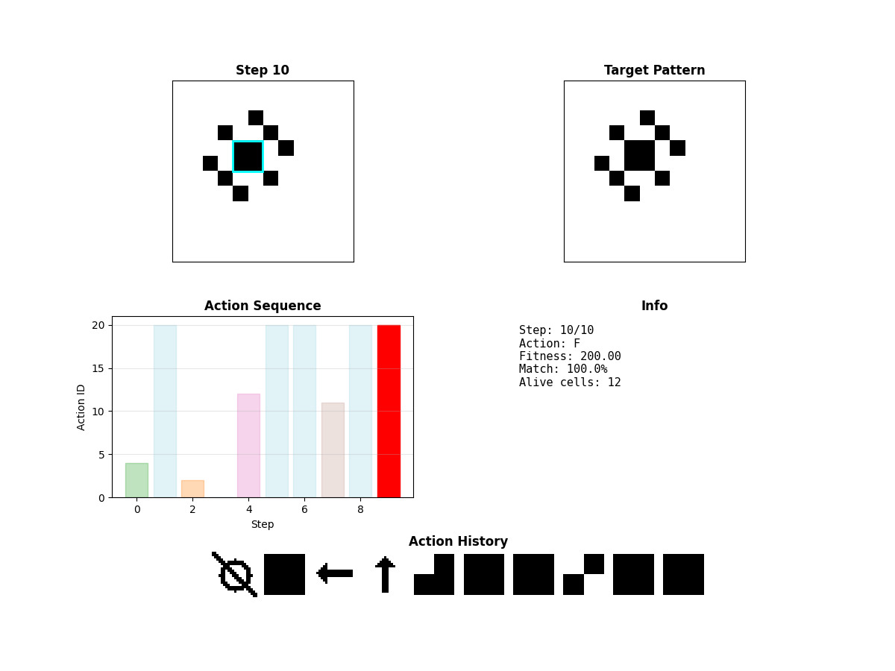

This repository has a Python Version of a Reinforcement Learning (RL) exploration under development.

The goal of the overall project is to have some RL agent learn to play a game in a cellular automata (CA) environment. (The game should also be playable by humans in manual mode... and this may even play into Supervised Learning pre-training.) More details on the website below. The RL training is meant to engage the user, be visual, and be part of a distributed machine learning project. That's why it's being done in a website. And to make it a truly distributed study, we are using client-side computation. TensorFlow.js was the choice for training in the browser even though it may usually just be used for inference in the browser. Tensorflow.js will be used in the final implementation approach, but in the current phase, the exploratory phase of just trying to nail down the game details and get RL to work, Python will be the language used. This repo will be the source of the ideas being developed.

The web page under development that uses tensorflow.js for RL training in the browser:
https://www.nets-vs-automata.net/rl.html

Once research is complete, the final configuration of the RL playground can be set-up again in tensorflow.js to keep the site a Distributed Learning site with ML/RL compute being being supplied by users on the client side.

Recent Updates:
-Ported RL for CA code from tensorflow.js on website to tensorflow Python for research & exploration.
--More accessible for other to explore code
--No need to focus on the UI aspects of the code
--Can train faster, without visualizations (compared to final website version)

To do:
-Review guided 'vibe' code porting from js to python
-Add more helpful visualizations and graphs
-Explore Puffer lib for RL possibilities

New Game: "Generate State"🪄䷷

Goal: Draw/generate a state/pattern on the board (starting from a blank cellular automaton canvas). 
For instance, show player/agent the picture of the pattern generated by F, (right), (up), F, F, F, F, F in the Game of Life. (see pic below)
See if they can figure out the key commands to get this state.

Game Dev Notes: These games should be easy to generate (and filter to interesting pictures (i.e.not blank) if not done randomly like our current implementation) but likely tough to solve.

Start with simple patterns, like a 2x2 block which just corresponds to a single "F" the hex command which translates to a 2x2 1111 block. Build to more complex.

Game Play Note: The website has a UI for drawing 2x2 blocks, but it seems like key strokes could be a better way of inputting values... it feels more like a coded spell than clicking a UI.



New reward type: 'pattern'

_generate_target_pattern() Generates a target pattern by executing random actions from a blank grid
Controlled by --pattern-steps argument (default: 10)
Prints the action sequence and pattern density for debugging

Reward calculation in step()

Negative BCE as reward (so lower BCE = higher reward)
Optional bonus (+10) when BCE < 0.01 (very close match)
Episodes don't end early as requested

Enhanced visualization for demo mode

Side-by-side view showing current grid and target pattern
Displays current BCE value in the title
Works in both manual and agent modes

(To do: look at pattern generation. Density of on cells is 0 a lot of time. We need to filter to good patterns, not randomly generate.)

Another Practical Approach to help RL learning that may be needed:
Log human play -> Supervised Learning Weight Initialization (mimic human actions) -> Final stage of RL 

(Like Alpha Go approach of training on top Go players before progressing to RL phase)

```
ca-rl v0.1.0
├── matplotlib v3.10.6
│   ├── contourpy v1.3.3
│   │   └── numpy v2.3.3
│   ├── cycler v0.12.1
│   ├── fonttools v4.60.1
│   ├── kiwisolver v1.4.9
│   ├── numpy v2.3.3
│   ├── packaging v25.0
│   ├── pillow v11.3.0
│   ├── pyparsing v3.2.5
│   └── python-dateutil v2.9.0.post0
│       └── six v1.17.0
├── numpy v2.3.3
├── scipy v1.16.2
│   └── numpy v2.3.3
├── tensorflow v2.20.0
│   ├── absl-py v2.3.1
│   ├── astunparse v1.6.3
│   │   ├── six v1.17.0
│   │   └── wheel v0.45.1
│   ├── flatbuffers v25.9.23
│   ├── gast v0.6.0
│   ├── google-pasta v0.2.0
│   │   └── six v1.17.0
│   ├── grpcio v1.75.1
│   │   └── typing-extensions v4.15.0
│   ├── h5py v3.14.0
│   │   └── numpy v2.3.3
│   ├── keras v3.11.3
│   │   ├── absl-py v2.3.1
│   │   ├── h5py v3.14.0 (*)
│   │   ├── ml-dtypes v0.5.3
│   │   │   └── numpy v2.3.3
│   │   ├── namex v0.1.0
│   │   ├── numpy v2.3.3
│   │   ├── optree v0.17.0
│   │   │   └── typing-extensions v4.15.0
│   │   ├── packaging v25.0
│   │   └── rich v14.1.0
│   │       ├── markdown-it-py v4.0.0
│   │       │   └── mdurl v0.1.2
│   │       └── pygments v2.19.2
│   ├── libclang v18.1.1
│   ├── ml-dtypes v0.5.3 (*)
│   ├── numpy v2.3.3
│   ├── opt-einsum v3.4.0
│   ├── packaging v25.0
│   ├── protobuf v6.32.1
│   ├── requests v2.32.5
│   │   ├── certifi v2025.8.3
│   │   ├── charset-normalizer v3.4.3
│   │   ├── idna v3.10
│   │   └── urllib3 v2.5.0
│   ├── setuptools v80.9.0
│   ├── six v1.17.0
│   ├── tensorboard v2.20.0
│   │   ├── absl-py v2.3.1
│   │   ├── grpcio v1.75.1 (*)
│   │   ├── markdown v3.9
│   │   ├── numpy v2.3.3
│   │   ├── packaging v25.0
│   │   ├── pillow v11.3.0
│   │   ├── protobuf v6.32.1
│   │   ├── setuptools v80.9.0
│   │   ├── tensorboard-data-server v0.7.2
│   │   └── werkzeug v3.1.3
│   │       └── markupsafe v3.0.3
│   ├── termcolor v3.1.0
│   ├── typing-extensions v4.15.0
│   └── wrapt v1.17.3
└── tqdm v4.67.1
```

# Command Line Tool for RL Training & Demos
# Train with default settings
python rl_ca.py train

# if you're using uv
uv run rl_ca.py train

# Train for more episodes with a different game mode
python rl_ca.py train --episodes 200 --reward maxwell_demon --grid-size 16

This will save the model weights (e.g., `ca_agent_weights_final.h5`) in the same directory.

# Watch the trained agent play or 
python rl_ca.py demo --weights ca_agent_weights_25.weights.h5

# Play manually (provide no weights file)
python rl_ca.py demo


# Draw A Pattern Game
# 1) First create a pattern
python rl_ca.py create_pattern --grid-size 12

# 2) Then train with that pattern
python rl_ca.py train --reward pattern --pattern-file custom_pattern_12x12.npy --live-plot

# 3) And demo with the same pattern
python rl_ca.py demo --reward pattern --pattern-file custom_pattern_12x12.npy --weights ca_agent_weights_final.weights.h5


# Manual mode to try it yourself
python rl_ca.py demo --reward pattern --pattern-file custom_pattern_12x12.npy --weights nonexistent.weights.h5 

# Train with live visualization
python rl_ca.py train --episodes 100 --live-plot --reward pattern --pattern-file custom_pattern_12x12.npy


## Code Developed At Recurse Center
The Recurse Center asks participants to program at the edge of their ability...

“The Edge... There is no honest way to explain it because the only people who really know where it is are the ones who have gone over. The others-the living-are those who pushed their control as far as they felt they could handle it, and then pulled back, or slowed down, or did whatever they had to when it came time to choose between Now and Later. But the edge is still Out there.”